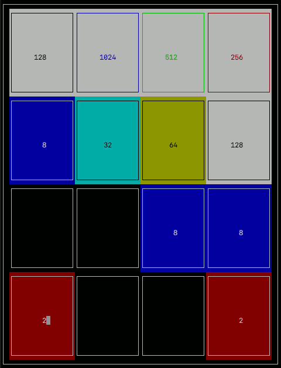

# c2048
c2048 is a version of the 2048 game written in the C programming language using the ncurses library.



- [How to Install](#how-to-install)
    - [Windows](#windows)
    - [MacOS](#macos)
    - [Linux](#linux)
- [How to Play](#how-to-play)
- [MacOS Screen Capture to GIF](#macos-screen-capture-to-gif)

## How to Install
### Windows
This must be done in a Unix-Like terminal environment that can compile and run C programs. Must also support ncurses.

**NOTE:**
1. Windows must be running a Unix-like command-line environment.
2. It must be able to compile and run C.
3. It must support the ncurses and math libraries.

One such environment is Cygwin. Download it here: http://cygwin.com/install.html

On install, be sure to include the ncurses and math packages.

1. In the [2048.h](2048.h) header file, modify the ncurses `#include` statement to look like this:
    ```
    #include <ncurses/ncurses.h>
    ```

2. Compile in Cygwin Terminal using the following command:
    ```
    gcc -o c2048 2048.c 2048_utils.c -lncurses
    ```

    **Note:** In some cases, you will need to link the Math library as well. Cygwin normally does this automatically; however, if it does not, compile using the following command:

        ```
        gcc -o 2048 2048.c 2048_utils.c -lm -lncurses
        ```

3. Run the program using the following command:
    ```
    ./c2048
    ```

### MacOS
1. In the [2048.h](2048.h) header file, modify the ncurses `#include` statement to look like this:
    ```
    #include <curses.h>
    ```

2. Compile in Terminal using the following command:
    ```
    gcc -o c2048 2048.c 2048_utils.cc -lcurses
    ```

3. Run the program using the following command:
    ```
    ./c2048
    ```

### Linux
This hasn't been tested on Linux, but it should work. The part that may be different is how the compiler uses the ncurses library. This may take some experimentation and research. If anyone finds out, please log an issue, and I'll update this documentation.

## How to Play
Run the executable:
```
./c2048
```

Use your keyboard's arrow keys to move the tiles horizontally and vertically to play! Try to get to 2048 if you can.

## MacOS Screen Capture to GIF
In order to capture the gameplay and convert it to a GIF, I did the following (most credit goes to this article: [How to Create a GIF from a Video File Using VLC and GIMP (maketecheasier)](https://www.maketecheasier.com/create-gif-from-video-gimp/)):

1. Use the Mac's built-in screen capture program to record gameplay

    In macOS Mojave, the `Shift-Command (⌘)-5` keyboard shortcut will open controls to record video and capture screenshots of the screen.

    For recording a specific part of the screen, follow [these instructions](https://support.apple.com/en-us/HT208721#portion).

2. Download [ffmpeg](https://trac.ffmpeg.org/wiki/CompilationGuide/macOS)
    Open up Terminal and install `ffmpeg`, a tool for recording, converting and streaming audio and video.
    ```
    brew install ffmpeg
    ```

3. Convert and trim video
    The command below is trimming the video to the last 20 seconds (`-sseof -20`) and converting it to a `.mp4` video format.
    ```
    ffmpeg -sseof -20 -i c2048.mov c2048.mp4
    ```

4. Separate the video frames into images
    ```
    mkdir frames
    ```
    ```
    ffmpeg -i c2048.mp4 -r 10 frames/image-%3d.pn
    ```

    `-r` is the frame rate, so approximately 5 per second. This command output 202 images. I deleted duplicates since there is no animation between states in this game (ncurses refreshes after all tiles have been merged and moved). The resulting number of images came out to be 20.

5. Using [GIMP](https://www.gimp.org/) (GNU Image Manipulation Program), I added all 20 images using “File” --> “Open as Layers”.

6. Manipulate image as necessary
    1. `Image` --> `Mode` --> `Indexed...` 
        * Set `Maximum number of colors`: `127`
    2. `Filters` --> `Animation` --> `Optimize (for GIF)`
    3. `Export As` --> `GIF` (select file extension)
        * Check `As Animation`
        * Use `500ms` for delay between frames
